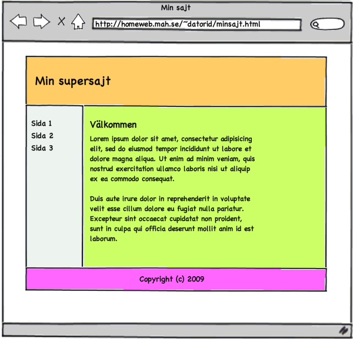
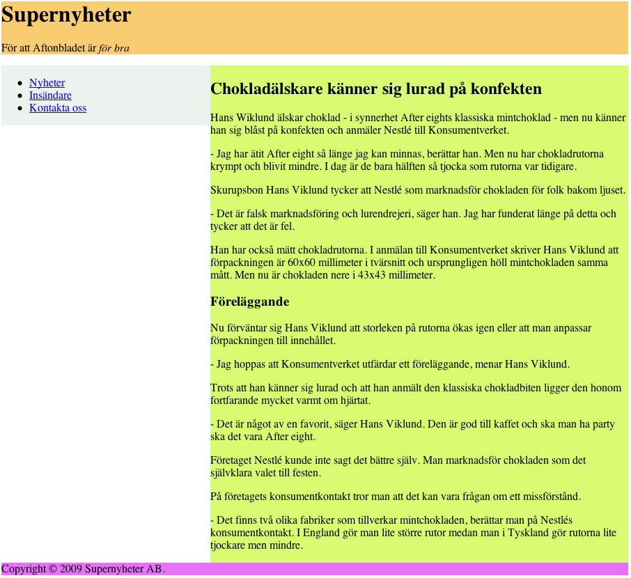
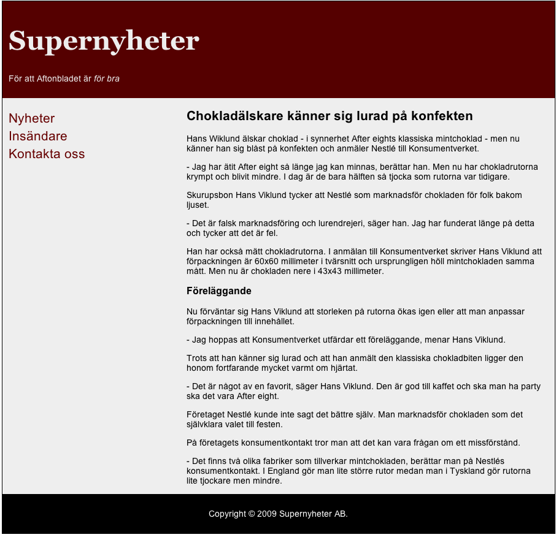

# Bootcamp - Del 4: Layout med CSS

I denna laboration ska du öva på positionering genom CSS och att få flera element i en webbsida att samverka. Du kommer lära dig att göra grunden till en webbplats och att använda denna på flera webbsidor.

**Avancerat**: Labben får gärna göras med grids och/eller flexbox för de som har erfarenhet, och föredrar detta.

## 1. Uppgift

Målet är att producera en layout, som likt många webbplatser på Internet består utav ett sidhuvud, en menykolumn, en innehållskolumn och en sidfot. Följande bild illustrerar målet:

För tydlighetens skull är de olika områdena färglagda, det bör vara framgå vad som är vad. Notera även att denna layout ska ha begränsad bredd samt vara centrerad.

### 1.1. Skelettet

En bra punkt att börja på är att lista ut vilken struktur HTML-dokumentet måste ha för att kunna stödja denna layout. Det ter sig naturligt att ha fyra separata delar för de olika områdena - denna indelning bör göras med element som beskriver vad varje del av webbsidan respresenterar, t.ex. sidhuvud/navigation/sidfot/etc. Genom att ge olika id till de olika områdena kan vi sedan ge dessa olika stilar genom CSS.

Skapa ett HTML-dokument och infoga de taggar som är lämpliga för layouten på bilden ovan (`header, nav, section, footer`-taggar). Lägg lite platshållartext i varje div, så att det syns att allt fungerar som det ska.

Även om det _fungerar_ så är det ännu inte så visuellt tilltalande. Skapa en extern CSS-stilmall och applicera den på HTML-dokumentet (se taggen `link` och föregående laboration). Ge sedan olika bakgrundsfärger till de fyra områdena genom att hänvisa till identiteterna du nyss skapat.

I detta skede kan det se ut såhär: 

### 1.2. Positionering

Som det nämndes ovan ska denna layout ha fast bredd och centreras. Börja med att innesluta de fyra områdena i en ny `
`, med id `container`. Sedan kan du i en ny CSS-regel ange bredden för denna - välj en "lagom" bredd (eller ungefär 900 pixlar vid beslutsångest).

Denna div ska sedan centreras. Undersök hur CSS-egenskapen `margin` kan användas i detta syfte.

Därefter återstår det faktum att navigationen och innehållsområdet ska ligga bredvid varandra. För att åstadkomma detta krävs tre steg:

1.  Ange önskvärd bredd för respektive område. Var noga med att totalbredden inte blir större än bredden för `#container`.
2.  Använd egenskapen `float` för att låta navigationen dra sig åt vänster och innehållsområdet dra sig åt höger (eller tvärt om, om du föredrar det).
3.  Sidfoten ska alltid hamna under navigationen och innehållet. Detta kan du se till med hjälp av egenskapen `clear`.

I detta skede bör du ha en centrerad layout, som ser ut ungefär såhär: 

### 1.3. Innehåll

Nu ter det sig vara dags att fundera över vad som faktiskt ska ligga i de olika områdena. Som alltid så är det lämpligt att först bestämma vilka HTML-taggar som bäst kan beskriva informationen, för att först därefter definiera utseendet med CSS. Här följer ett förslag på vilket innehåll som bör finnas var, och vilken HTML som är lämplig.

<table>
    <thead>
        <tr>
            <th>Område</th>
            <th>Innehåll</th>
            <th>Lämplig HTML</th>
        </tr>
    </thead>
    <tbody>
        <tr>
            <th rowspan="2">header</th>
            <td>Logotyp</td>
            <td><code>h1</code>
            </td>
        </tr>
        <tr>
            <td>Tagline</td>
            <td><code>p</code>
            </td>
        </tr>
        <tr>
            <th rowspan="2">nav</th>
            <td>Meny med länkar</td>
            <td><code>ul</code>  <code>li</code> och <code>a</code>
            </td>
        </tr>
        <tr>
            <td>Länkar till W3C-validatorn</td>
            <td>Den HTML som ges efter godkänd validering</td>
        </tr>
        <tr>
            <th rowspan="2">section</th>
            <td>Rubrik på innehåll</td>
            <td><code>h2</code>
            </td>
        </tr>
        <tr>
            <td>En mängd text</td>
            <td><code>p</code> och vad annat som ter sig lämpligt</td>
        </tr>
        <tr>
            <th>footer</th>
            <td>Upphovsrättsinformation</td>
            <td><code>p</code>
            </td>
        </tr>
    </tbody>
</table>
Skapa denna struktur. Om du inte kan komma på något eget ämne för innehållet så kan du _låna_ en artikel från din favorittidning (men kopiera i så fall själva texten, inte källkoden).

Därefter kan det se ut ungefär såhär: 

### 1.4. Bättre form

När det gäller vidare visuell utformning av denna webbsida så finns det förstås lika många möjliga inriktningar som det finns människor. Här följer några förslag:

*   Ta bort bakgrundfärg för `nav, section` - och lägg till bakgrundfärg för `#container`. Ändra bakgrundfärg för `header` och `footer`.
*   Välj ett snyggt typsnitt och ange en textstorlek.
*   Definiera hur länkar ska se ut (glöm inte `:visited` och `:hover`).
*   Lägg till padding för att få lite luft mellan text och layoutens kanter. (Tänk på att padding påverkar totalbredden för ett element)
*   Ta bort listpunkterna från navigationsmenyn och gör den mer distinkt till utseendet.
*   Ge logotypen ett unikt utseende.
*   Centrera texten i `footer`.
*   Experimentera!

Dokumentet kan sedan - till exempel - se ut såhär: 

### 1.5. Flera sidor

Eftersom all CSS ligger i en externa stilmall kan samma utseende enkelt fås på flera sidor. Kopiera ditt HTML-dokument till en ny fil. Byt ut innehållet i `section` till något annat och länka sedan mellan dina två dokument (kanske i navigationsmenyn?).

## 2. Validering och feedback

Som alltid, se till att dokumentet [validerar](http://validator.w3.org/). Använd [CSS-validatorn](http://jigsaw.w3.org/css-validator/) för alla stilmallar. Be kursare och labbassistenter om feedback för en djupare bild av vad som är bra och dåligt.
