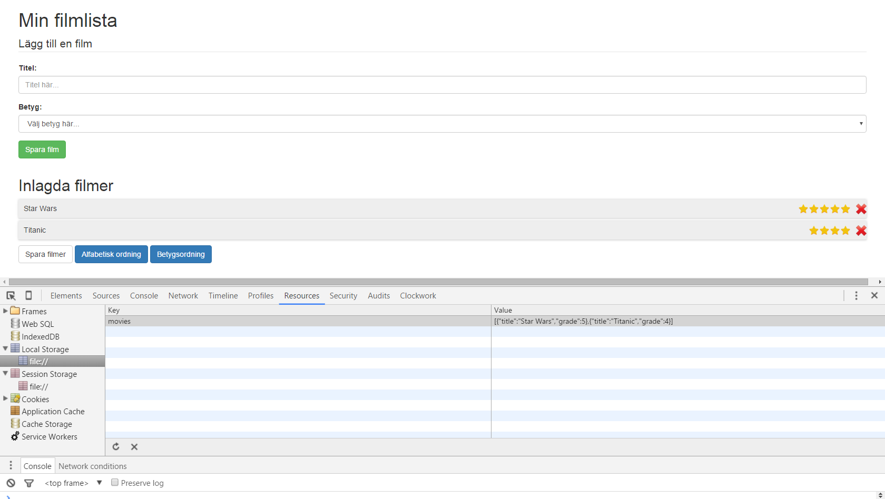

# Laboration 7 - LocalStorage & SessionStorage

## Introduktion

Vi ska i denna labboration utgå ifrån [5.3. Filmlista](ex9.html#filmlista). Men istället för att de filmer man lägger in försvinner när man laddar om sidan, så ska dessa sparas lokalt hos användaren genom localStorage. Vi tittade även i uppgiften hur vi kunde sortera våra filmer, denna sortering ska vi komma ihåg så länge användaren besöker vår webbsida, alltså den sessionen. När användaren sedan stänger webbläsaren och besöker webbsidan igen ska sorteringen vara nollställd.

### Att spara filmerna i localStorage

Nu när vi ska spara våra filmer i localStorage, snarare än bara tillfälligt på webbsidan, så behöver vi fundera på hur vi ska strukturera upp våra filmer. Ett förslag skulle kunna vara något i stil med:

```js
var movies = [
  {
    title: "Star Wars",
    grade: 5
  },
  {
    title: "Titanic",
    grade: 4
  }
];
```

Alltså, vi har en array, men filmernas information. För att sedan kunna sortera filmerna (utöver titel och betyg) kanske vi skulle lägga till ett id, alternativt tiden som de lades till i listan - så att vi har möjlighet att sortera filmerna efter detta också.

För att spara arrayen med filmerna i localStorage - som bara sparar strängar - behöver vi göra om vår array till JSON. Detta genom funktionen `JSON.stringify(movies)`
{:.info}

En enkel funktion för att spara filmerna i localStorage som JSON skulle kunna se ut på följande sätt (när man klickar på elementet `#save-movies` ):

```js
$("#save-movies").on("click", function(){
	var JSONMovies = JSON.stringify(movies);
	localStorage.setItem("movies", JSONMovies);
});
```

Det som händer är att vi tar vår array med filmer, omvandlar detta till JSON-format (sträng), och sedan sparar det i localStorage genom nyckeln *movies*. Vi kan nu om vi tittar i utvecklingskonsolen i t.ex. Chrome, under fliken *Resources* se vad som finns sparat i localStorage, i vårt fall följande:

<a href="10/developer-console.png"></a>

Såhär långt har vi följande lösning att utgå från:

```js
// Vår array med filmer, två filmer inlagda som exempeldata
var movies = [
  {
	title: "Star Wars",
	grade: 5
  },
  {
	title: "Titanic",
	grade: 4
  }
];

function printMovies(){
  /* @TODO Skriver ut alla filmerna i vår array "movies" */
}

$("#save-movie").on("click", function(e){
  /* @TODO Sparar en film i vår array "movies" när vi klickar på knappen "Spara film"
    och skriver sedan ut den uppdaterade listan av filmer genom funktionen "printMovies"
  */
});

$("#save-movies").on("click", function(){
  /* Sparar vår array med filmer som JSON i localStorage */
	var JSONMovies = JSON.stringify(movies);
	localStorage.setItem("movies", JSONMovies);
});

$("#load-movies").on("click", function(){
  /* @TODO Läser in våra filmer från localStorage och skriver ut dessa i vår lista på sidan,
    samt sparar filmerna i vår array "movies"
  */
});

$("#order-alphabetic").on("click", function(){
  /* @TODO Sorterar filmerna alfabetiskt */
});

$("#order-grade").on("click", function(){
  /* @TODO Sorterar filmerna efter betyg */
});

$(".delete-movie").on("click", function(){
  /* @TODO Tar bort en film från vår array */
});

function getStars(grade){
  /* @TODO genererar stjärnor till när filmerna ska visas
    Returnerar HTML-kod för så många stjärnor som parametern "grade" anger */
}

// Skriver ut att filmerna i vår lista när sidan laddats klart
printMovies();
```

Era uppifter nu består av att färdigställa koden ovan, så att den fungerar enligt specifikation.

#### 1. Skriv klart funktionen *printMovies()*

Detta så att när sidan laddas klart, så ska filmerna i listan vara de som finns i vår array "movies".

#### 2. Skriv klart funktionen för att spara en ny film

Så att vi kan lägga till fler filmer i vår lista! Det kan vara idé att automatiskt spara filmerna i localStorage när man sparar en ny film så att man inte glömmer att spara dem sedan. *Men detta får ni själva välja hur ni vill göra*.

#### 3. Skriv klart funktionen för att ladda in filmer från localStorage

Istället för att vår array "movies" ska ha filmer hårdkodade i sig, ska ni när sidan laddas nu istället läsa in de filmer som finns sparade i localStorage. Dessa filmerna ska sedan visas på webbsidan för användaren.

För att läsa in JSON till en array igen (från localStorage) kan ni använda `JSON.parse(localStorage.getItem("movies"))`.
{:.info}

#### 4. Ta bort filmer

Gör det möjligt att ta bort filmer från vår lista. Tänk på att dessa ska tas bort från vår array "movies". Det kan vara idé att automatiskt uppdatera filmerna i localStorage när man tar bort en film så att man inte glömmer att spara dem sedan. *Men detta får ni själva välja hur ni vill göra*.

#### 5. Sortera filmerna efter betyg eller titel

Skriv klart funktionerna för att sortera filmerna efter titel eller betyg. Om ni väljer att sortera dem direkt i HTML-koden (som i förra laborationen) eller genom att sortera arrayen med filmern är upp till er. Men sidan ska komma ihåg hur ni sorterat filmerna under hela sessionen som användaren besöker webbsidan (tills användaren stänger webbläsaren).

Ni användaren `sessionStorage` på samma sätt som `localStorage` och kan läsa mer om [sessionStorage här](https://developer.mozilla.org/en-US/docs/Web/API/Window/sessionStorage).
{:.info}

#### 6. BONUS! Filtrera era filmer

Ni kan nu om ni vill genom attributet `data-*` (samt i er array med filmer egenskaper) lägga till information om filmens:

- genre
- år den släpptes

Gör sedan en drop down-lista för att välja genre att sortera efter, eller fråga användaren efter ett årtal att filtrera filmerna efter. **OBS.** Detta förutsätter också att ni skapar två nya text-fält där användaren, när denna skapar en ny film, kan lägga till genre och årtal.

### Exempel på HTML-kod att utgå från

Denna exempelkod använder sig utav bootstap för sitt utseende:

```html
<div class="row container-fluid" style="padding:0 50px;">
  <div class="xs-col-12">
    <h1>Min filmlista</h1>
    <form>
      <fieldset>
        <legend>Lägg till en film</legend>
        <div class="form-group">
          <label for="title">Titel:</label>
          <input type="text" class="form-control" id="title" placeholder="Titel här...">
        </div>
        <div class="form-group">
        <label for="Grade">Betyg:</label>
          <select id="grade"  class="form-control">
            <option value="0">Välj betyg här...</option>
            <option value="1">1</option>
            <option value="2">2</option>
            <option value="3">3</option>
            <option value="4">4</option>
            <option value="5">5</option>
          </select>
        </div>
        <div class="form-group">
          <button id="save-movie" class="btn btn-success">Spara film</button>
        </div>
      </fieldset>
    </form>
    <h2>Inlagda filmer</h2>
    <ul id="movie-list">

    </ul>
    <button id="save-movies" class="btn btn-default">Spara filmer</button>
    <button id="order-alphabetic" class="btn btn-primary">Alfabetisk ordning</button>
    <button id="order-grade" class="btn btn-primary">Betygsordning</button>
  </div>
</div>
```
