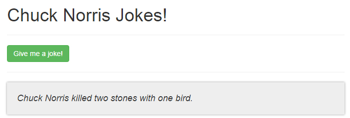
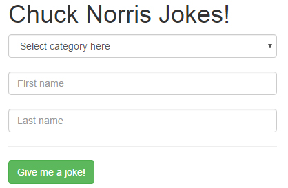
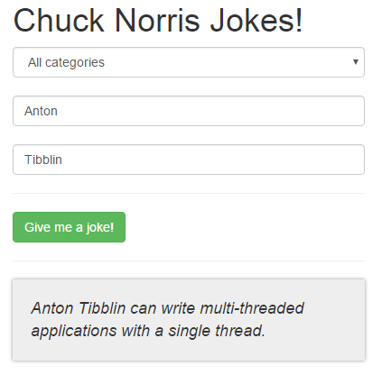
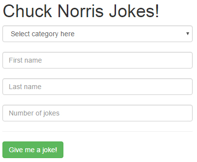
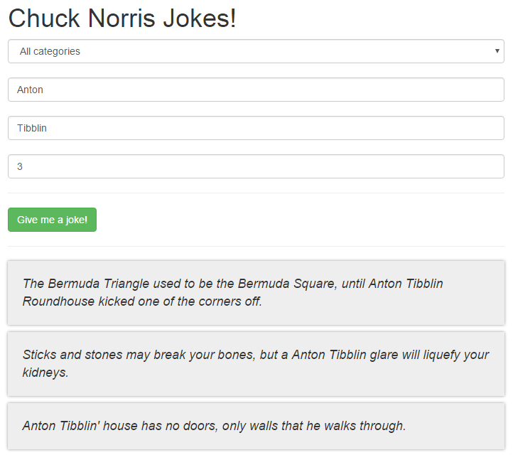
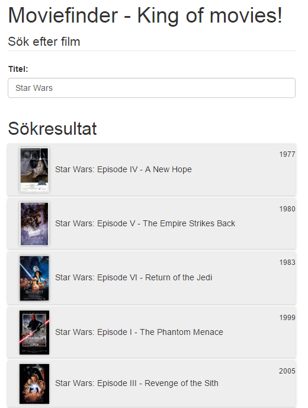

# Laboration 6 - Introduktoin till ajax

## Introduktion

Vi ska i denna laboration börja med att använda ajax för att dynamiskt ladda in extern data i våra webbsidor, genom att använda oss utav [API](https://en.wikipedia.org/wiki/Web_API). Detta kan till exempel vara Chuck Norris-skämt, eller filminformation för en given söksträng, eller given film.

Börja med att kolla in [veckans föreläsning](#) (kommer när föreläsningen är publicerad) för en snabb introduktion till vad vi kommer att jobba mer här i labben.

## Del 1 - Förbättra Chuck Norris-tjänsten

Vi byggde på föreläsning en mycket enkelt tjänst som hämtade in ett slumpis skämt om Chuck Norris när man klickade på en knapp. Tjänsten såg ut på följande sätt:


Och när man klickade på knappen "Give me a joke!" så visades ett skämt (som hämtades från [detta api](http://www.icndb.com/api/)):



Koden för detta exempel, som vi kommer att utgå från, kan ni hämta [här](#) (kommer när föreläsningen är publicerad).

### A) Bygg ut tjänsten - Välj kategori på skämt

Chuck Norris-skämten som hämtas från vårt [api](http://www.icndb.com/api/) kan delas in i olika kategorier. Vi vill nu att användaren ska kunna välja kategori på skämtet som hämtas - genom en drop-down menu. Detta gör att ni i ert ajax-anrop till api:t behöver skicka med parametern `limitTo`, som ni kan läsa mer om under rubriken `Limiting categories` [i dokumentationen för api:t](http://www.icndb.com/api/).

Ett exempel-anrop för att får ett slumpvist skämt från kategorin "nerdy", skulle kuna se ut på följande sätt:

```
http://api.icndb.com/jokes/random?limitTo=[nerdy]
```

Gör nu så att man kan välja mellan kategorierna:

- all categories
- nerdy
- explicit

Er tjänst borde därefter se ut enligt följande:


- **Bonus**: Tänk på att validera så att användaren väljer en av kategorierna (all categories/nerd/explict), annars ska inget ajax-anrop ske. Utan användaren ska istället meddelas att en kategori måste väljas.

När detta fungerar bra, så går vi vidare till nästa del!

### B) Bygg ut tjänsten - Välja namn för skämten (istället för Chuck Norris)

Vi ska nu skräddarsy tjänsten ännu mer! Detta så att istället för namnet "Chuck Norris" i våra skämt, så ska vi kunna ange vilket namn som skämtet ska handla om. Något i stil med:



Läser man dokumentationen för [api:t under rubriken "Changing the name of the main character"](http://www.icndb.com/api/) så ser man att vi kan skicka med följande parametrar för att ange för och efternamn för skämtet:

- firstName
- lastName

Det är nu er uppgift att implementera detta, så att vi kan skicka med namnet. Det borde se ut något i stil med detta när det är klart:



- **Bonus**: Tänk på att validera så att användaren skriver in något namn. Validera detta och meddela användaren att ett för- och efternamn måste finnas.
- **Bonus 2**: Gör så att namnet "Chuck Norris" är förinskrivet i text-fälten.

### C) Bygg ut tjänsten - Ange antal skämt som ska hämtas

Just nu hämtas bara ett skämt åt gången, er uppgift nu blir att användaren kan ange hur många skämt som ska hämtas. Detta genom att ange en valfri siffra. I API-dokumentationen läs under rubriken `Fetching multiple random jokes`.



Ni ska sedan skriva ut alla skämten som hämtas och resultatet borde se ut såhär:



- **Bonus**: Kontrollera att användare skriver in en siffra mellan 1 och 10.

---

## Del 2 - Filmsökning

Denna del kommer vara mer fristående, men kommer att likna en av deluppgifterna i inlämingsuppgift 2 - så har ni gjort denna så kan ni återanvända delar av er arbete senare.

### A) Filmsökning

Vi ska nu kunna söka efter olika filmer genom att ange en titel för en film. För kunna söka efter filmer (och få svar på sökningen) behöver vi ett API som tillhandahåller denna tjänst. Ett sådant API är [OMDb API](https://www.omdbapi.com/) (notera att ni måste skapa en gratis API-nyckeln [här](http://www.omdbapi.com/apikey.aspx). Gå in på sidan och läs dokumentation för att förstå möjligheterna med API:t och svara på följande frågor:

- Vilka tjänster tillhandahåller API:t?
- Vilken tjänst ska användas vid en filmsökning?
- Vilken information måste skickas med vid en filmsökning?
  - Hur ser en exempel-URL ut för filmen `Star Wars`?
- Hur kommer mitt svar att se ut (i JSON)?
  - Hur kan jag skriva ut alla svar som jag får tillbaka (alla filmerna)?

När ovanstående frågor är besvarade så är det dags att gå vidare! Jag tänker mig att filmsökningstjänsen ska se ut något i stil med:


Vi vill nu, när användaren skrivit in *minst 3 tecken i sökrutan* kalla på API:t, göra en sökning och sedan visa upp svaren på ett lämpligt sätt. T.ex.



Fundera på hur ni ska lösa detta, fråga gärna. Men denna delen av laborationen är det meningen att ni själva ska förstå det API som ni använder (läs dokumentationen) samt hur ni skriver ut filmernas resultat. Tankesättet liknar väldigt mycket det som ni har gjort i Chuck Norris-delen av denna labb.
